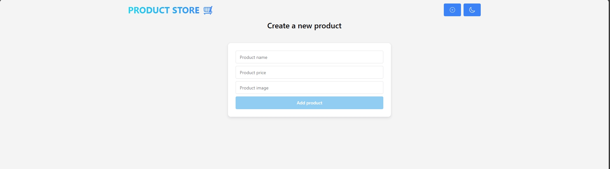
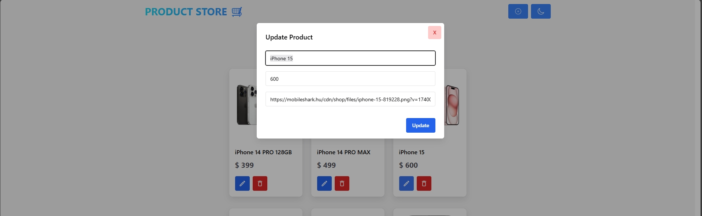

# 🛒 Mini Webshop

[Live Demo](https://mini-webshop.onrender.com/)

## Screenshots




## 📌 About the Project
Mini Webshop is a **full-stack e-commerce application** built with **React (frontend)** and **Node.js/Express (backend)**. It provides a simple and efficient shopping experience, allowing users to browse products, manage inventory, and place orders.

## 🚀 Features
✅ **Full-Stack Architecture** (React, Node.js, Express, MongoDB)  
✅ **Product Management** (CRUD operations)  
✅ **User Authentication** (Login & Registration - Future Feature)  
✅ **Cart & Checkout Functionality** (Planned)  
✅ **Responsive Design with Chakra UI**  
✅ **State Management using Zustand**  
✅ **REST API Integration**  

## 🏗️ Tech Stack
### **Frontend:**
- React.js ⚛️
- Chakra UI 💅
- React Router 🛤️
- Zustand (State Management) 🌿
- Vite (Development Server) ⚡

### **Backend:**
- Node.js 🌍
- Express.js 🚀
- MongoDB 🗄️
- Mongoose (ORM) 🔗
- dotenv (Environment Variables) 🔐

## 📂 Project Structure
```
mini-webshop/
│── backend/            # Express.js server & API
│   ├── models/        # Mongoose models
│   ├── routes/        # API routes
│   ├── server.js      # Entry point
│
│── frontend/           # React application
│   ├── src/
│   │   ├── components/ # Reusable UI components
│   │   ├── pages/      # Application pages
│   │   ├── store/      # Zustand state management
│   │   ├── App.jsx     # Main App component
│   │
│── package.json        # Dependencies & scripts
│── .env.example        # Example environment variables
│── README.md           # Project documentation
```

## 🛠️ Installation & Setup
### **1️⃣ Clone the Repository**
```sh
git clone https://github.com/Skaikru0518/mini-webshop.git
cd mini-webshop
```

### **2️⃣ Install Dependencies**
```sh
npm install
npm install --prefix frontend
```

### **3️⃣ Setup Environment Variables**
Create a `.env` file in the **backend/** folder and configure your environment variables:
```sh
MONGO_URI=your_mongodb_connection_string
PORT=5000
```

### **4️⃣ Run the Application**
#### **Start the Backend**
```sh
npm run backend
```
#### **Start the Frontend**
```sh
npm run frontend
```

## 🔧 Available Scripts
| Command | Description |
|---------|-------------|
| `npm run backend` | Starts the Express backend with nodemon |
| `npm run frontend` | Runs the React frontend (Vite) |
| `npm run build` | Builds the frontend for production |
| `npm start` | Runs the backend in production mode |

## 📜 License
This project is **MIT Licensed**. Feel free to modify and use it!

## 📬 Contact
💡 Created by **Skaikru0518**  
📌 **GitHub:** [Skaikru0518](https://github.com/Skaikru0518)  

